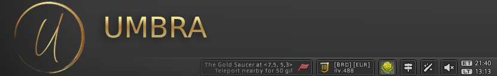

**Umbra** is a Dalamud Plugin for Final Fantasy XIV that consolidates commonly used HUD elements into a single uniform
interface. It also provides 3D world markers for several points of interest, such as hunt marks, gathering nodes, and
more.

The settings window can be opened by typing `/umbra` in the chat window, or by clicking the `Umbra Settings` item in the
system menu on the toolbar (if enabled).

## Table of Contents

1. [Toolbar](#toolbar)
   1. [Main Menu](#main-menu)
   2. [Added features](#added-features)
   3. [Currencies Menu](#currencies-menu)
   4. [Location and Weather](#location-and-weather)
   5. [Other widgets](#other-widgets)
2. [World Markers](#world-markers)
   1. [3D Markers](#3d-markers)
   2. [Direction Indicator](#direction-indicator)
   3. [Marker Types](#marker-types)
3. [Theme Configuration](#theme-configuration)
   1. [Applying presets](#applying-presets)
   2. [Importing and Exporting](#importing-and-exporting)
   3. [Customizing the color scheme](#customizing-the-color-scheme)

---

# Toolbar

Umbra provides a toolbar that can be used to quickly access commonly used features, such as the main menu, location and
weather, a gearset switcher and more. The toolbar can be either docked to the top or bottom of the screen, or it can be
disabled if you prefer not to use it.

## Main Menu

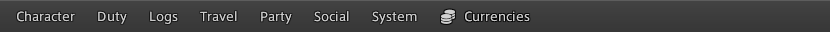

The main menu serves as a replacement for the main menu button list. It is docked to the left side of the toolbar and
allows quick access to the game's native features, as well as some extras provided by Umbra. The main menu opens
sub-menus when clicked, or on hover if a sub-menu is already opened. This mimics the behavior or most operating system
menu bars in applications.

### Added features

Three options have been added to the `System` menu:

- **Dalamud Plugins** - Opens the Dalamud Plugins window
- **Dalamud Settings** - Opens the Dalamud Settings window
- **Umbra Settings** - Opens the Umbra Settings window

Two static options have been added to the `Travel` menu:

- **Teleport** - Opens the teleport window.
- **Return** - Casts the return spell, if allowed at time of invocation.

Aetheryte locations that are registered as Favored Destinations automatically
show up in the `Travel` menu to give you quick access to them.

### Currencies Menu

The currencies widget sits next to the main menu and gives you quick access to an overview of your currencies in the
form of a sub-menu, similar to the main menu items. Clicking a currency will track it by replacing the "Currencies"
label and icon with the selected currency. This allows you to quickly see how much of a specific currency you have
without having to open the currency window. Clicking the tracked currency again in the sub-menu will untrack it and
revert back to the default "Currencies" button.

## Location and Weather

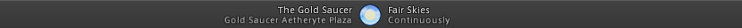

The location and weather widget sits in the center of the toolbar and displays the current zone and weather. Clicking
the widget will open a weather-forecast pop-up that shows the weather for the next couple of hours.

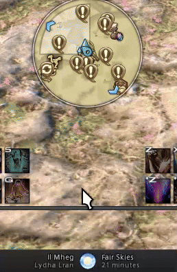

## Other widgets

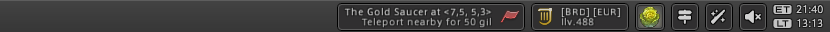

All other widgets are docked to the right side of the toolbar.

### Flag Marker

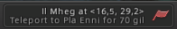 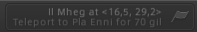

The flag marker widget only shows up if a flag marker has been set. Clicking the widget while it is active does one of
the following:

- **Left click** - Teleport to an aetheryte that is near the flag.
- **Right click** - Remove the marker. This will also hide the widget until a new flag has been set.

The widget will be shown in a disabled state (grayed out & slightly transparent) if one of the following conditions are
true:

- There is no nearby Aetheryte to teleport to.
- Your character is currently in a state in which it is unable to cast the Teleport action.

Removing the flag by right clicking the widget is still possible in the disabled state.

### Gearset Switcher

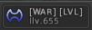

The gearset switcher widget allows you to quickly switch between your gearsets. Clicking the widget will open a popup
that lists all your saved gearsets, categorized by job role. Clicking a gearset will equip it, if the game allows it at
the time.

The popup also shows a set of buttons that allows you to perform some actions with the currently equipped gearset:

- **`Update`** - Updates the currently equipped gearset with the current gear.
- **`Duplicate`** - Creates a new gearset based on the currently equipped gear. (Same as new)
- **`Delete`** - Deletes the current gearset (right-click only, to prevent accidental deletion).
- **`Move Up`** - Move the gearset up one slot within the list it is shown in.
- **`Move Down`** - Move the gearset down one slot within the list it is shown in.

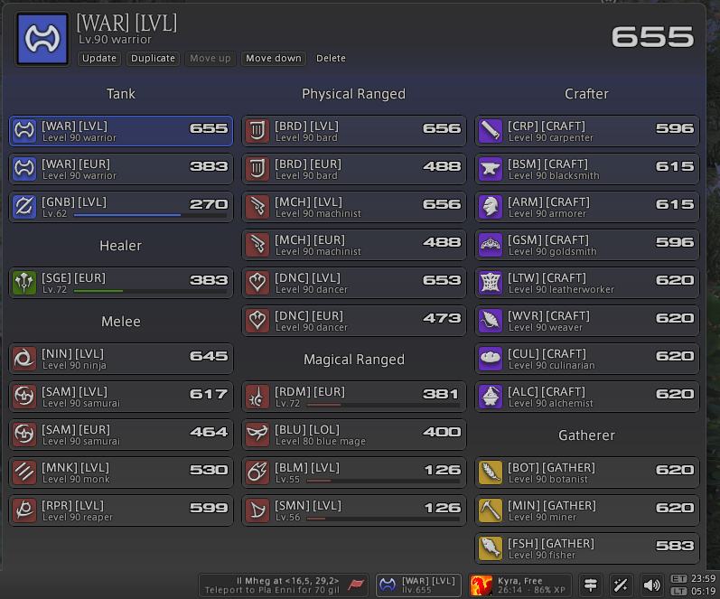

### Companion Widget

The companion widget allows quick access to your Chocobo. The widget can be shown in several states:

#### Gysahl Greens (Disabled)

If the widget shows a disabled state (grayed out), it means that your Chocobo is unavailable, or you are unable to use
Gysahl Greens due to your character being mounted or otherwise occupied, or you don't have any Gysahl Greens in your
inventory.

#### Gysahl Greens (Enabled)

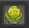

If the widget only shows a Gysahl Greens icon and is not grayed out, you can left-click the widget to summon your
Chocobo. This uses one Gysahl Greens from your inventory.

#### Summoned state

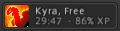

Once your Chocobo has been summoned as it physically present in the game world, the widget will show its name, the
current stance, it's remaining time and XP (if below level 20).

If your chocobo has been summoned, but is not active (e.g. when you are mounted or in a sanctuary), the widget only
shows the current stance icon. Text elements are hidden in this state. This lets you know that your Chocobo is still
active and will return to your side once you are back in the open world and not mounted.

### Misc Widgets

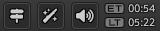

Miscellaneous widgets are shown to the far right. These consist of the following:

#### World Marker Visibility

Clicking the world marker visibility widget will open a sub-menu that allows you to quickly toggle the visible world
markers on and off. This is useful if you are quickly looking for a specific point of interest and don't want to open
the Umbra settings window.

#### Battle Effects Intensity

Clicking the battle effects intensity widget will open a sub-menu that allows you to quickly toggle the intensity of
battle effects for your character, party members, other players and PvP enemies. These options mimic the ones that are
otherwise available through the Character Configuration window.

#### Unread Mail Indicator

Whenever you receive new mail, an unread mail indicator will show up in the same area as the other miscellaneous
widgets to let you know that you have unread mail. Once you have read all pending messages, the indicator will
disappear again.

#### Volume Control

The volume control widget allows you to quickly adjust the volume of the game, as well as specific channels. The widget
has the following controls:

- **Left-click** - Open the volume control popup that contains sliders for several audio channels.
- **Right-click** - Mute/unmute the game audio entirely.

#### Time

Last but not least is the time widget. This widget always shows Eorzea time and either your local time or the server
time. The latter can be toggled by left-clicking on the local or server time.

The time widget can also be configured to show in a horizontal layout, which will show the Eorzea time on the left and
the local/server time on the right. This can be configured through the Umbra Settings window under the
`Toolbar Settings` tab.

---

# World Markers

Umbra provides a system that renders physical markers for several points of interest in the game world. Presentation of
these markers are divided into two categories: **3D Marker** and **Direction Indicator**.

## 3D Markers

3D markers are rendered in the game world and consist of an icon, a label, an optional sub-label and a distance
indicator.

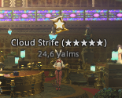

If multiple markers are close to each other, they will be consolidated into a single marker. Consolidated markers will
show a maximum of three combined markers. If there are more than three markers in the same spot, the remaining markers
will not be shown. This should never happen in practice as there is no scenario in which more than three markers are
shown in the same spot.

In this example, both the flag marker and an unobtained Tripe Triad card are shown as a single 3D marker:

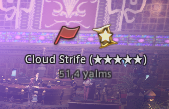

### Fading Behavior

3D markers will start to fade out once your character is within a certain distance of the marker. This distance is
determined by the marker type themselves and cannot be configured. The fading behavior is intended to prevent cluttering
the screen when the information is no longer relevant.

An example of different fading behaviors can be seen when comparing the Flag marker to Eureka Bunny coffers. The Flag
marker starts to fade out when you are within 50 yalms of the flag, while the Eureka Bunny coffers start to fade out
when you are literally on top of them. This is because the flag is a general point of interest, while the coffers are
specific points of interest that you need to find.

Another factor that determines whether a flag is transparent or opaque is whether it is occluded by other objects or the
terrain. If the camera has no clear line of sight to the marker, it will be shown as transparent and ignore distance
fading. This is to let you know that the marker is there, but might be behind a wall or cliff. This option can be
toggled in the Umbra Settings window under the `Marker Settings` tab.

## Direction Indicator

When a 3D marker is currently out of view (behind the camera), a direction indicator will be shown to help you locate
the marker. These indicators are shown in a circular fashion around the player or edge of the screen. The distance from
the edge of the screen is configurable in the Umbra Settings window under the `Marker Settings` tab.

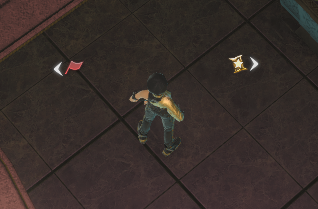

## Marker Types

Umbra provides markers for the following points of interest:

### Flag marker

The flag world marker is shown whenever a flag is set and is in the same zone as your character.

### Eureka Bunny Coffers

When you are in Eureka and farming bunny FATEs, Umbra will help you locate a treasure coffer after you have used the
`Lucky Carrot`. By parsing the message that shows up when you use the Lucky Carrot, Umbra will show world markers for
the treasure coffers based on the direction and distance that is inferred from the message.

For example, when the message says `You sense something far to the north`, Umbra knows that the treasure coffer is
between 100 and 200 yalms to the north of your current position. Only markers that match the detected direction and
distance will be shown. Continuously using the `Lucky Carrot` and moving in the specified direction will eventually
narrow down the visible coffer markers to a single one.

#### Map & Minimap markers

Map (and minimap) markers are also added for the detected coffer locations if this option is enabled via the Umbra
Settings window under the `Marker Settings` tab.

> [!IMPORTANT]
> This feature is unavailable if you also have the Eureka Linker plugin installed and enabled. This plugin
> also provides features that use map markers, which would cause conflicting behavior if both are enabled. Enabling this
> setting and having Eureka Linker enabled will cause Umbra to disable this feature automatically.

### Quest Objectives

Objective markers are shown for currently active quests in the current zone. These consist of talking to NPCs,
interacting with objects, combat areas and handing in items and finishing quests. There are no markers for quests that
you have not already accepted.

Note that markers are not shown if the objective is not in the same zone as your character.

### Gathering Nodes

When you're currently in a Gathering job, nearby nodes are shown as markers. Gathering node markers are only visible if
you are in close proximity to them, similar to how the game shows these nodes on your minimap.

### Hunt marks (Notorious Monsters)

Hunt marks are shown as markers when you are in a zone where a hunt mark is active. The markers are only shown if the
hunt mark is within a certain range of your character, similarly to how the game shows these marks on your minimap. An
exception of this is an `S` rank monster, which is always shown, regardless of the distance to your character.

### FATE markers

FATE markers are shown for all active fates in your current zone. This is particularly useful when you are in Eureka or
Bozja where FATE hunting is the primary source of progression. Markers should the status of the FATE (e.g. `Running`),
the time it has remaining and, if somebody is currently participating in the FATE, the progress percentage of the FATE.

### Unobtained Triple Triad Cards

Unobtained Tripe Triad cards are shown when they are obtained through an NPC via a Triple Triad Match or a vendor. There
is an additional option to also show Triple Triad cards that are unobtainable because they are locked for your character
due to unmet requirements. When this option is enabled, a marker _may_ lead you to a place where an NPC does not exist,
or has an option to buy or win the card from. This option is disabled by default.

---

# Theme Configuration

Umbra allows you to customize the appearance of the UI by adjusting its color scheme. You can access the appearance
configuration by opening the Umbra Settings window and navigating to the `Umbra Appearance` tab.

## Applying presets

Umbra comes with three built-in presets that you can click to apply them to your current color scheme.

### Dalamud

The Dalamud preset applies the color scheme that you currently have configured in Dalamud. Note that some elements might
need slight adjustments since there are no available color values for some elements. These include the `Muted Text` and
the different `Outline` colors. Highlight and Accent colors are derived from the Tab colors in Dalamud.

### Dark

This is the default theme that Umbra uses when it is first installed.

### Light

The Light theme is a light-colored theme that is easier on the eyes in bright environments.

## Importing and Exporting

The current color scheme can be imported or exported using the two buttons in the top-right hand corner of the window.

When exporting, the current color scheme will be put in your clipboard as a Base64-encoded string. You can then share
this string with others to import. A notification will appear when the color scheme as been added to your clipboard.

When importing, Umbra expects a valid exported string to be present in your clipboard. If the import process fails, a
notification will show up that tells you that something went wrong.

## Customizing the color scheme

The colors listed in this window all describe what they are and what they are used for. Clicking on the color swatch to
the left of an item opens up the color picker in which you can adjust the color to your liking.

All modifications made to the color scheme are stored automatically, so there is no need to manually save your changes.
